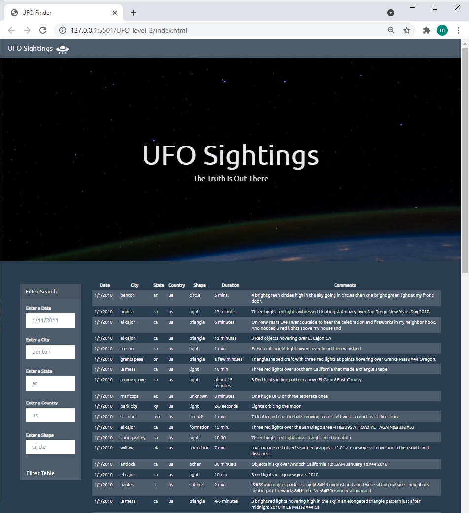

# javascript-challenge
Repo for HW 14

This activity imports an array of objects representing data from sightings of UFOs. 

An typical sighting includes the following data:
   * datetime: "1/1/2010",
   * city: "bonita",
   * state: "ca",
   * country: "us",
   * shape: "light",
   * durationMinutes: "13 minutes",
   * comments: "Three bright red lights witnessed floating stationary over San Diego New Years Day 2010"

Using only JavaScript, HTML, and CSS, and D3.js the task is to create two web pages to display all the sightings data as an html table.

The Level 1 (UFO-level-1) directory includes index.html which initially displays all the data, and then allows the user to filter to a specific date via a form (displays all data if form is empty).

The Level 2 (UFO-level-2) directory includes index.html which initially displays all the data, and then allows the user to filter to multiple criteria via a form (displays all data if form is empty). The user may enter all or any of the following: 
  1. `date/time`
  2. `city`
  3. `state`
  4. `country`
  5. `shape`

  The Level 2 employs two uses multiple list items (html tag: li) to allow the user to enter multiple criteria. The level 2 Javascript app.js employs a for loop to filter the data by each criterion using an iterative approach to reduce the number of variables needed and lines of code. The conditional "if (d3.select(entry.id).property("value"))" returns true just when the user has submitted a filter value in the corresponding filter box and only filters the data any further in that case. The constant idColmap that was used to iterate has an opportunity to be further reduced since the id's and columns names were matched deliberately (only difference being the # at the beginning of the id).

## Level 2 Screenshot 
  